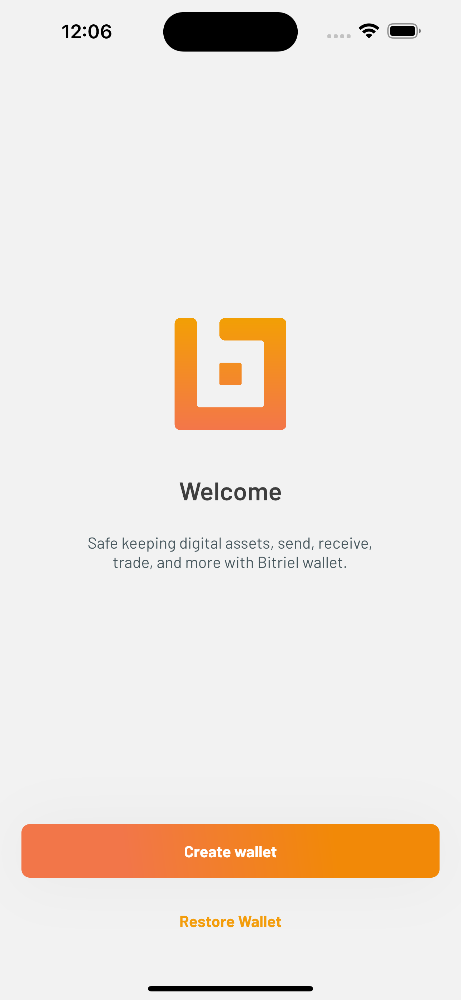
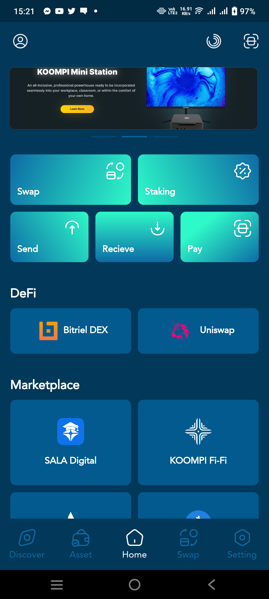
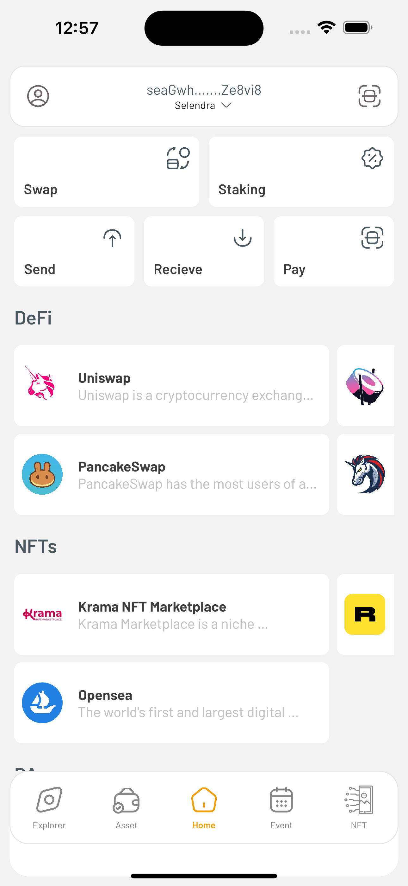
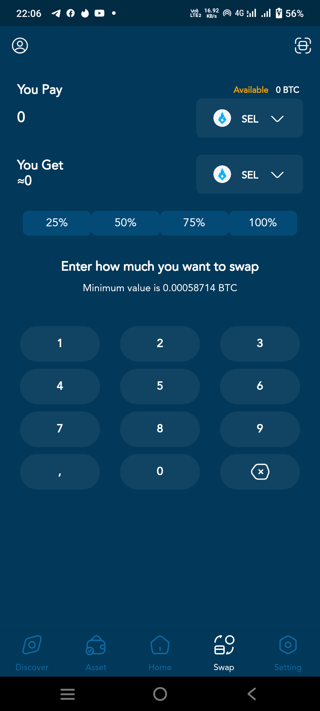

# Welcome to Bitriel Wallet!

**Digital wallet** management for cross-chain assets, staking and governance operations, collection and self-owned private key.

This project is build on **polkadot substrate blockchain** technology. 

 
 
## Prerequisites:

#### Linux OS: 
- [KOOMPI OS](https://dev.koompi.org/iso/)
-   [Flutter](https://flutter.dev/docs/get-started/install) 
-  [Android SDK](https://developer.android.com/android-studio/download)latest version 
-   [Git](https://git-scm.com/) ( if you don't have )
#### MacOS: 
-   Xcode latest version that compatible with your MacOS
-   [Flutter](https://flutter.dev/docs/get-started/install) latest version 
-  [Android SDK](https://developer.android.com/android-studio/download)
-   [Git](https://git-scm.com/) ( auto install after install xcode )
-   [Homebrew](https://brew.sh) ( if you don’t have ) 


## Environment setup

In this section we assume you have one among both OS on your machine. If you are using Macebook we recommend you are have Mac Catalina 10.15.7 or latest MacOS.
#### Setup on KOOMPI OS:
1. [Installing android studio](https://medium.com/koompi/installing-android-studio-on-koompi-os-86aa5b6b199c).
2. [Installing flutter](https://medium.com/@condaveat/installing-flutter-in-koompi-os-82428bdb493b)
3. Run ```flutter doctor``` to check your missing part of your installation.

#### Setup on MacOS:

1. Follow instruction of installing [Flutter on Mac](https://flutter.dev/docs/get-started/install) and we recommend you to store flutter SDK inside Documents folder to easy manage.
- #### Below are additional setup after follow above instruction from flutter website.

2. Open terminal and run ```nano ~/.zshrc```. this file is where you add path of flutter script.
	- Add path for Flutter:
	```export PATH=$PATH:/Users/mac/Documents/flutter/bin```
	- Here for android sdk if you wanna setup:
	```export ANDROID_HOME=/Users/mac/Library/Android/sdk``` and 
	```export PATH=$PATH:$ANDROID_HOME/platform-tools:$ANDROID_HOME/platforms```
3. After add path you need to refresh shell script file ```source ~/.zshrc```.
4. Let's run ```flutter doctor``` to check your missing part of your installation.
5. Let's clone bitriel project to place.
6. After finish setup iOS navigate into kaabob folder that place inside bitriel-wallet. let's run commend ```flutter create .``` to generate some file for run iOS for (Podfile, etc).
7. Now you are finish setup flutter and able to run Bitriel project on your machine.
## Run app:
In this section, We assume you complete setup Flutter and Android SDK on Linux OS or MacOS. Let's test with Bitriel project.

#### With Simulator:
- For Android follow instruction in [this website](https://flutter.dev/docs/get-started/install/macos#set-up-the-android-emulator) to able launch and run emulator:
- For iOS, launch simulator by below commend:
```open -a simulator```

#### With Real device:
- For Android follow instruction that project by flutter [Real device setup](https://flutter-examples.com/run-test-flutter-apps-directly-on-real-android-device/).
- For iOS after plug real device with your machine. In terminal inside kaabob folder run flutter command ```flutter run```. Otherwise, you will face error if you are not setup few things like ```apple developer account``` inside Xcode. So please read this docs [Deploy on real device](https://flutter.dev/docs/get-started/install/macos#deploy-to-ios-devices) again.
## Project Structure:

### Available soon !

## Web3.js
Clone from polkawallet_sdk